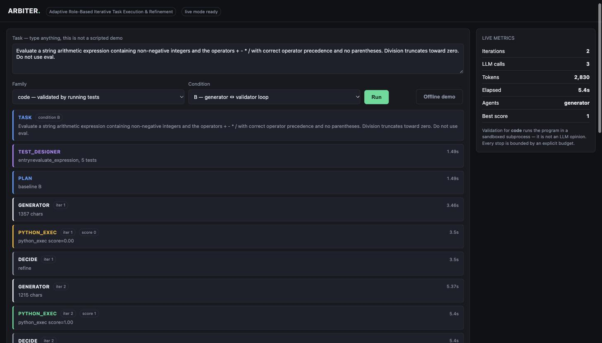

# ARBITER — What We Built, Why, and What Comes Next

**Adaptive Multi-Agent System for Iterative Task Generation, Validation and Refinement**<br>
Gautam Lasgotra (23BCS032) · Chirag Attri (23BCS024) · Aniket Kundal (23BCS015)<br>
Guide: Dr. Sonika Gupta, SoCSE · SMVDU Katra · **3 October 2026**<br>
Repository: `github.com/igautamlasgotra/arbiter` · Live: `arbiter-gules-two.vercel.app`

---

## 1. The research objective

### 1.1 The question

> **Under a matched token budget, does adaptive multi-agent refinement actually
> improve correctness over a single agent — and does the answer depend on how
> strong the available automatic verifier is?**

### 1.2 Why this question and not "can agents build software"

Multi-agent refinement is not new. Neither is adaptive orchestration — there is a
published survey of it. **This project claims novelty in neither**, and says so in
the synopsis. Claiming otherwise would not survive a viva.

What is genuinely unresolved is narrower and more interesting. Two bodies of work
disagree:

| Position | Evidence |
|---|---|
| Multi-agent refinement helps | Self-Refine, Reflexion, AgentCoder, ChatDev, MetaGPT |
| It mostly does not, once you pay for it | Tran & Kiela (2025): at equal *thinking-token* budget, one agent matches or beats multi-agent systems on reasoning |

Both can be true at once — if the benefit depends on whether a cheap, trustworthy
**verifier** exists for the task. Huang et al. (ICLR 2024) supply the mechanism:
without external feedback, a model cannot reliably correct itself.

Here is the gap we occupy. Adaptive orchestration's entire justification is
*"spend agents only where they are needed"* — a claim about **compute efficiency**.
It has therefore never been tested by the one protocol that measures compute
efficiency directly: **budget matching**. We run that test, across three task
families chosen to differ in verifier strength.

### 1.3 Why this is safe to attempt on a deadline

**A negative result is a valid result.** "We built it, held the budget equal, and
adaptivity did not pay off on family X" is a finding, not a failure. No other
framing available to us has that property.

### 1.4 The questions, stated precisely

- **RQ1** Under a matched token budget, does adaptive orchestration beat (a) a
  budget-matched single agent and (b) fixed multi-agent pipelines?
- **RQ2** Does any benefit track **verifier strength** (executable tests →
  execution match → answer only)?
- **RQ3** Does combining a tool validator with an LLM critic reduce **false
  accepts** compared with LLM-only review?
- **RQ4** How many refinement iterations stay useful before returns vanish?

---

## 2. What the system is — and what it is not

ARBITER takes a task in plain English, decides which agent roles to use, produces
a solution, **validates it by running it**, feeds the failures back, and revises —
until it passes or a budget stops it. Every step is recorded.

### 2.1 What it deliberately does not do

It does not build applications, games, websites or mobile apps. This is not a
missing feature; it is a direct consequence of the research question.

The loop works because the validator returns an **objective score**. Ask for a
Flutter app and nothing can produce that score: there is no single return value to
assert on, and "is this calculator good?" has no automatic answer. Without a
verifier the loop degrades into one model asking another model for an opinion —
**which is precisely the thing Huang et al. showed does not work, and precisely
what this project is gathering evidence about.**

So the system **declines** tasks it cannot check, in plain words, rather than
appearing to validate them. Knowing the boundary of what it can verify is a
property of the design, not an apology for it.

---

## 3. The logic — why each part exists

### 3.1 An agent is a function, not a framework

```python
def generator(task, router, state, feedback=None):
    prompt = build_prompt(task, feedback)
    resp   = router.call(prompt, schema=SOLUTION_SCHEMA, state=state)
    return Solution.model_validate_json(resp.text)
```

A role prompt, one model call, a typed parse. Agents differ **only in their system
prompt**: `repair` is told not to trust the previous approach, `critic` is told to
review sceptically. No LangGraph, no AutoGen — the orchestration logic *is* what
the project studies, so burying it inside a framework would hide the contribution.
(AutoGen is also in maintenance mode.)

### 3.2 The orchestrator is a bounded loop

```
Task → Planner → ┌─ Generator ─→ Validators (tools first, critic second) ─┐
                 │        ▲                                               │
                 │     feedback ←──────── Decision policy ────────────────┘
                 └─ accept / refine / add agent / stop   (budget-governed)
```

It can never run unbounded. It stops on acceptance, 5 iterations, 20 model calls,
60,000 tokens, 180 seconds, two iterations without improvement, or a repeated
identical output. **Every stop reason is logged as an enum.** The last condition
matters: step repetition is the single most common documented multi-agent failure
mode — 17.1% of failures in the MAST taxonomy (NeurIPS 2025).

### 3.3 Validation contains no LLM

For code, `python_exec` writes the program and its tests to a temp directory, runs
them in a **separate process with no inherited environment**, and reports which
named tests failed. That subprocess is the external feedback the entire loop
depends on.

### 3.4 The score is graded, not binary

`0.80` means four of five tests passed. Without partial credit the system could not
tell *"getting closer"* from *"stuck"*, and the no-improvement stop condition would
be meaningless. It also makes defects visible — see §5.3.

### 3.5 The test-designer agent

Benchmark tasks ship with tests. A task typed by a panel member does not. The
test designer derives executable tests from the description **and fixes the
function signature**, which is then handed to the generator — otherwise the tester
invents `two_sum` while the generator writes `twoSum` and everything fails for the
wrong reason.

Generated tests are parsed and checked before use: they must define `check_*`
functions, must call the declared entry point, must be valid Python, and may
import only from a pure-standard-library allowlist. `random` and `time` are
excluded deliberately — a non-deterministic test destroys the refinement signal.

**Stated limitation:** model-written tests are not ground truth. They are used for
live unseen tasks only. All benchmark measurement uses the dataset's own tests, and
the two are never mixed in results.

### 3.6 The budget governor — the methodological heart

Every model call is metered: prompt tokens, completion tokens, calls, wall time.
This is not instrumentation added at the end. **It is what makes a budget-matched
comparison possible at all**, and therefore what the research contribution rests on.

### 3.7 The five conditions

| ID | Condition | Roles on screen |
|---|---|---|
| **A** | Single agent, one shot | generator |
| **A+** | Single agent given **the same token budget as D**, spent on repeated sampling with majority voting | generator ×N |
| **B** | Generator ↔ validator refinement loop | generator |
| **C** | Fixed pipeline | generator → critic → **repair** |
| **D** | ARBITER adaptive — planner picks roles and depth per task | varies |

**A+ is what makes the project credible.** Most student multi-agent projects compare
against a single call, declare victory, and ignore that the multi-agent system spent
five times the tokens. A+ removes that confound. It is deliberately **denied the
validator** — if it could see test results it would be a refinement loop, not a
single agent, and the comparison would be rigged.

All five share one engine and differ only by configuration, so a difference can
never come from implementation divergence.

---

## 4. How we built it

### 4.1 Stack

| Layer | Choice | Reason |
|---|---|---|
| Language | Python 3.10 | Local install; ecosystem |
| API | FastAPI + Server-Sent Events | One-directional stream, self-reconnecting, far less code than WebSockets |
| Types | Pydantic v2 | Forces structured model output into typed objects |
| Orchestration | Custom, ~400 lines | The object of study must stay readable |
| Model | Google Gemini Flash-Lite via raw REST | Exact control over the request body, real token counts |
| Sandbox | Subprocess, stripped env, timeout | Generated code must not reach API keys |
| Storage | JSONL traces + on-disk response cache | Every metric is computed from traces; no second pipeline |
| Hosting | Vercel (fluid compute) | Fluid compute is what lets one request stream for a whole run |

### 4.2 Layout

```
arbiter/
├── core/          schemas.py, state.py      ← frozen contracts + budget governor
├── llm/           base, cache, gemini, router, mock
├── agents/        roles.py, test_designer.py
├── validators/    python_exec.py, answer_match.py
├── sandbox/       runner.py                 ← isolated subprocess
├── orchestrator/  loop.py, planner.py, baselines.py
├── web/           app.py, templates/        ← FastAPI + SSE
└── bench/         runner.py, metrics.py, datasets/
```

### 4.3 Decisions worth defending

| Decision | Alternative | Why |
|---|---|---|
| Role **selection** from a fixed library | Inventing agents at runtime | Runtime invention is unbounded and unreproducible — a demo, not an experiment |
| Tools validate, LLM critic only advises | LLM-only review | Self-correction without external feedback is unreliable; the critic's verdict is logged separately to **measure** false accepts |
| Disk response cache from day one | Add caching later | Re-runs cost nothing and become byte-reproducible; without it the free-tier quota makes the experiment infeasible |
| Graded score | Binary pass/fail | Partial credit is what detects improvement and stagnation |
| Raw REST, no Gemini SDK | Official SDK | The cache key depends on the exact request body; also gives real `usageMetadata` counts |
| Token-gated live runs on the public host | Open endpoint | A public URL that executes model-written Python is a remote shell |

### 4.4 Quota strategy

A full sweep is several thousand calls against a free tier. Four controls:
the **response cache** (52% hit rate on the first sweep, so re-runs are largely
free), **round-robin across keys** with per-key daily-quota retirement, a
**resumable runner** that checkpoints after every task-run and continues exactly
where a quota error stopped it, and a **reserved demo key** the experiment runner
never touches, so demo-day quota is always fresh.

---

## 5. What is working today

### 5.1 Verified live behaviour

Run on the deployed instance, task typed at runtime, condition C:

```
test_designer   entry=solve, 5 tests
generator       solution produced
python_exec     score=0.80          ← FAILED: 4 of 5 tests passed
llm_critic      passed=True         ← the LLM said it was fine
decide          refine
repair          new solution (a different agent)
python_exec     score=1.00          ← accepted
```



### 5.2 The most important line in this report

Look at the two validator lines above. **The executed tests said FAIL. The LLM
critic said PASS.** The LLM was wrong and the program execution was right.

That is Huang et al.'s result reproduced live on our own system, and it is the
entire justification for building tool-based validation instead of asking a model
to review itself. It is also RQ3 made visible: the interface flags it as a
**FALSE ACCEPT**.

### 5.3 The validator caught a defect in our own benchmark

On the first sweep one task scored **0.75 under every condition**. Identical
partial scores across all five is itself a signal — a model failure would vary
between conditions, a task failure would not.

The generated code was **correct**. The task asked for a run-length encoding *only
when strictly shorter*; for `'aaabbc'` the encoding `'a3b2c1'` is six characters
against six, so returning the original was right. Our own test demanded the
encoding. **The benchmark was wrong, not the model.** Task rewritten, affected runs
deleted, all conditions re-run.

Graded scoring made it visible; the trace made it diagnosable. A project whose
entire output is a comparison table must be able to tell *"the system is wrong"*
from *"the measurement is wrong"*.

### 5.4 Measured results so far

25 task-runs with the real API, all five conditions, computed from
`traces/smoke.jsonl`:

| Condition | n | Pass rate | Mean tokens | Mean calls |
|---|---|---|---|---|
| A — single agent | 5 | 100% | 240 | 1.0 |
| A+ — budget-matched single | 5 | 100% | 431 | 1.6 |
| B — generator ↔ validator | 5 | 100% | 240 | 1.0 |
| C — fixed pipeline | 5 | 100% | 240 | 1.0 |
| **D — adaptive** | 5 | 100% | **561** | 2.0 |

**Read this honestly.** Every condition solves every task, so these numbers
**cannot separate the conditions on correctness**. The smoke set is a development
fixture, not a benchmark — the tasks are easy enough for one model call, which is
what a smoke set is for. The correct conclusion is that the measurement pipeline
works end to end.

What the cost column already shows is the shape of the problem: at identical
correctness, **the adaptive condition spent 2.3× the tokens of the single agent**,
because its planner adds a call before any work begins. If that gap does not buy
correctness on harder tasks, it is cost with no return — exactly the deflationary
result this project exists to test rather than assume.

### 5.5 Engineering status

**48 automated tests pass offline**, with no API key. They cover budget stops,
cycle detection, sandbox timeout and **environment isolation**, graded partial
credit, cache-key sensitivity, test-designer rejections, the budget-matched
baseline never using the validator to choose, the metrics module refusing to
aggregate mock runs, the demo-token gate, and a full streaming run over HTTP.

---

## 6. What comes next

| Phase | Dates | Work |
|---|---|---|
| **Phase 2** | 11 – 31 Oct | Full benchmark datasets (HumanEval+/MBPP+, Spider, GSM8K); SQL family and its execution validator; evaluate condition D properly; cross-model reviewer experiment |
| **Phase 3** | 1 – 10 Nov | Frozen benchmark sweep; comparative results; ablation on iteration count (RQ4) and validator type (RQ3); failure classification using MAST; report |
| **Final** | 23 – 27 Nov | Report, demonstration, viva |

### 6.1 What the datasets are and why those three

| Dataset | What it is | Verifier strength |
|---|---|---|
| **HumanEval+ / MBPP+** (EvalPlus) | 164 + ~400 Python problems. EvalPlus adds ~80× more tests than the originals, which were weak enough to let wrong code pass | **Strong** — per-test partial credit |
| **Spider** | ~200 databases, English → SQL, checked by running the query and comparing results | **Medium** — final result only |
| **GSM8K** | Grade-school maths word problems, checked on the final answer | **Weak** — no usable intermediate signal |

Three families, not one, because **that axis is the experiment**. One family gives
an anecdote; three give a line. This is what answers RQ2.

### 6.2 A realistic extension, if scope grows

Not application generation. The honest next step is **multi-file Python projects** —
a small CLI or package where the system writes a pytest suite for the whole package.
That stays verifiable, so the research claim survives. This is the direction
SWE-bench points in. It is out of scope for this semester.

---

## 7. Limitations, stated plainly

- **Only function-level tasks are verifiable.** Applications, UIs and servers are
  declined by design (§2.1).
- **Model-written tests are not ground truth.** Used for live tasks only; never
  mixed into benchmark results.
- **Majority voting is weaker for code than for maths.** Two correct programs
  rarely match character for character, so A+ is a weaker opponent on code. This is
  reported as a limitation and is itself part of the result.
- **Windows lacks POSIX resource limits**, so the sandbox there enforces only a
  timeout. Final experiment runs should be done under WSL or Docker.
- **Benchmark contamination** is a known risk for HumanEval and GSM8K; EvalPlus's
  extra tests reduce but do not remove it. Declared in threats to validity.
- **One model family (Gemini)**, so results may not transfer — which is exactly why
  the cross-model reviewer experiment is in Phase 2.
- **One API key currently provisioned.** The first sweep already retired it once on
  a rate limit, which the router handled by design.

---

## Appendix A — How to test the system

Open the demo link, type a task, press **Run**. For the live demo use
**condition C**: it puts three distinct agents on screen (generator → critic →
repair), which is the shape the project review asked for.

### Tasks verified on the deployed instance

| Task | Family | Result observed |
|---|---|---|
| Evaluate an arithmetic expression with `+ - * /`, correct precedence, no parentheses, no `eval` | code | **0.80 → refine → 1.00** (best demo; under C the critic false-accepted) |
| Fully justify a list of words into lines of exact width | code | **0.80 → refine → 1.00** |
| Convert a Roman numeral to an integer, handling `IV`, `IX`, `XL`, `CM` | code | 1.00 first attempt |
| Merge overlapping intervals | code | 1.00 first attempt |
| n-th Fibonacci number | code | 1.00 first attempt |
| Second largest distinct value in a list | code | 1.00 first attempt |
| Palindrome ignoring case and punctuation | code | 1.00 first attempt |
| 7 pens at ₹12, paid ₹100 — change? (expected answer `16`) | math | 1.00, accepted |
| "Make a sudoku game as a Flask app" | code | **Declined**, with the reason |

A first-attempt pass is correct but undramatic. **To show the loop working, use one
of the first two.**

### What to watch, in order

| Event | What it proves |
|---|---|
| `TEST_DESIGNER — entry=solve, 5 tests` | The task was unseen; tests were written for it on the spot |
| `GENERATOR iter 1` | First attempt |
| `PYTHON_EXEC score=0.80` | Code actually executed — 4 of 5 tests passed |
| `LLM_CRITIC passed=True` | The model's opinion, recorded but never authoritative |
| `DECIDE refine` | The policy decided, not the model |
| `REPAIR` | A different agent re-solves |
| `PYTHON_EXEC score=1.00 → accept` | Fixed |

### Other things worth demonstrating

- **The budget really stops it.** Ask for something impossible ("a function that
  solves the halting problem"). It stops on `max_iterations` or `no_improvement`
  instead of looping — and says which.
- **Maths is the weak verifier.** Run a maths task with its expected answer. The
  validator can only say right or wrong, never which step was wrong. That contrast
  with `python_exec` is RQ2 in one screen.
- **It declines what it cannot check.** Ask for an app. The refusal is the point.
- **Offline demo** runs the whole loop with a scripted provider and no API key;
  runs made this way are tagged `mock` and the metrics module refuses to aggregate
  them into results.
- **Replay** re-streams a stored real run with original timings, clearly labelled,
  so the demonstration survives a dead key or venue wifi.

### Local

```bash
pip install -r requirements-dev.txt
pytest -q                                      # 48 tests, no API key needed
python -m uvicorn arbiter.web.app:app --reload # http://127.0.0.1:8000

python -m arbiter.bench.runner --dataset smoke --conditions A B C
python -m arbiter.bench.runner --dataset smoke --conditions D --adaptive
python -m arbiter.bench.runner --dataset smoke --conditions A+      # run D first
python -m arbiter.bench.metrics traces/smoke.jsonl --by-family
```

---

## Appendix B — Work distribution

| Member | Owns |
|---|---|
| **Gautam Lasgotra** (23BCS032) | System architecture, orchestration loop and decision policy, budget governor, provider abstraction with caching and key rotation, sandboxed execution, web interface and streaming, deployment, integration |
| **Chirag Attri** (23BCS024) | Agent role library and prompt design, structured output schemas, test-designer agent, LLM critic, provider integrations |
| **Aniket Kundal** (23BCS015) | Benchmark task format and datasets, execution validators, metrics module, resumable experiment runner, test suite, failure classification |
